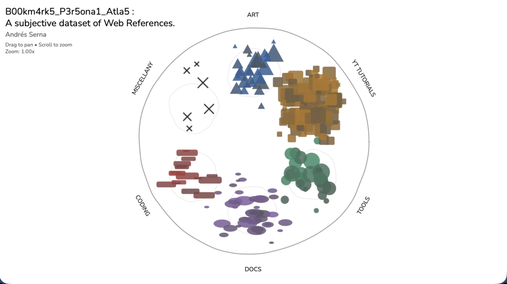
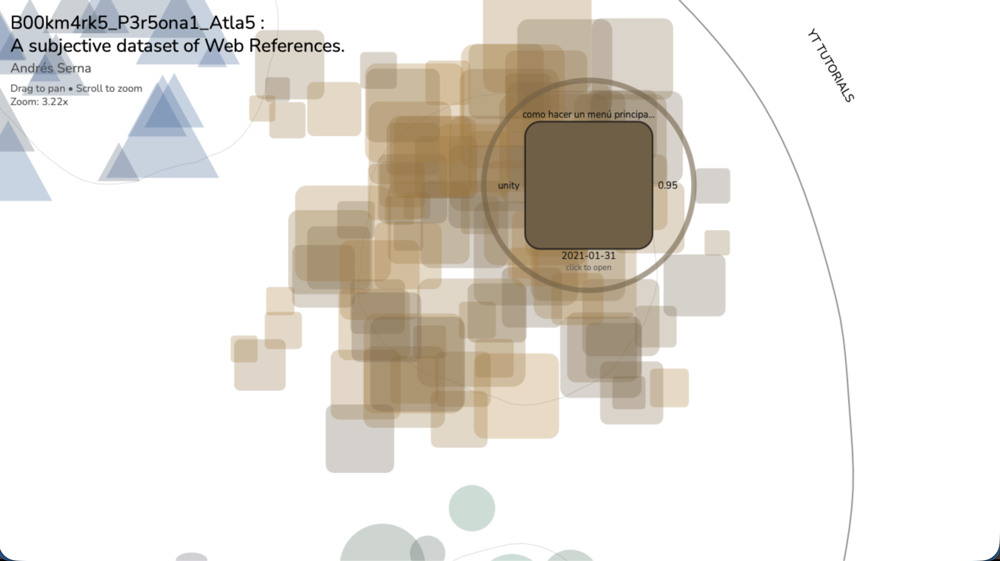
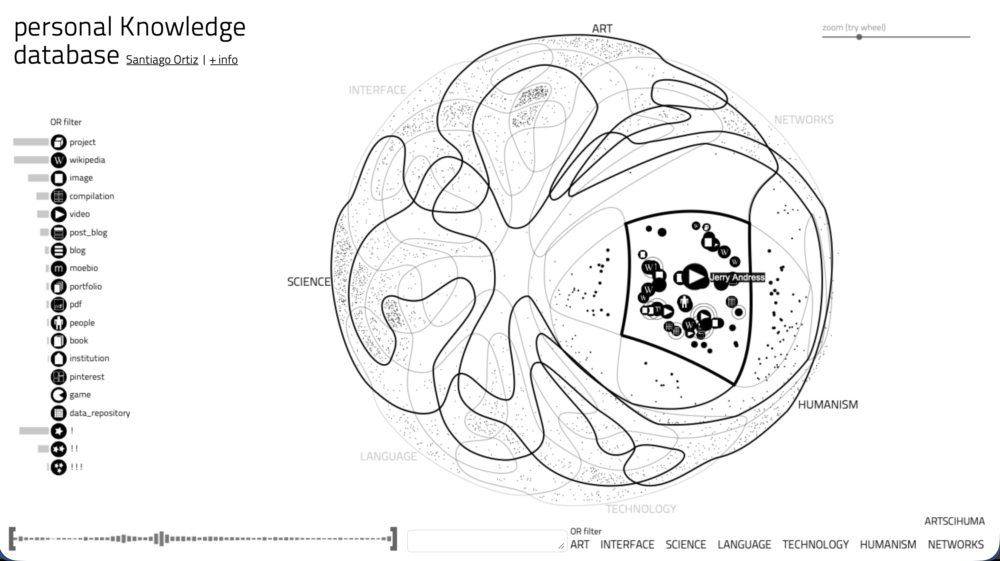
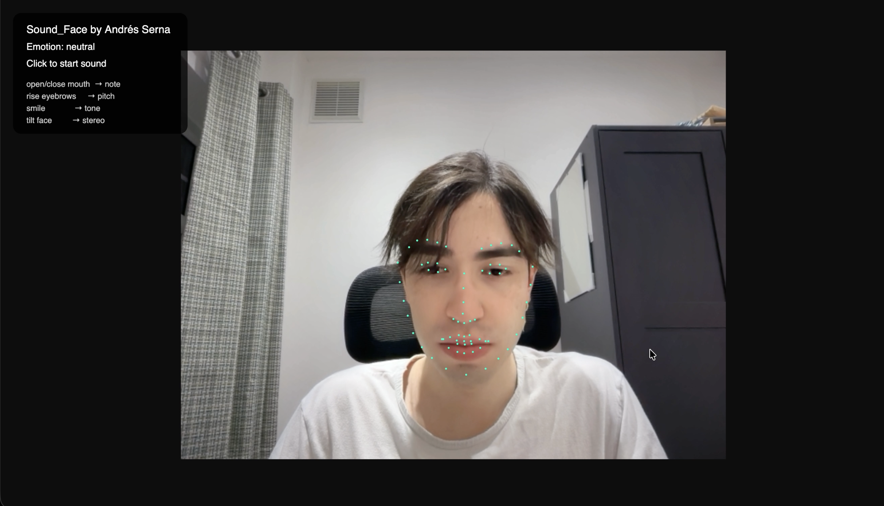
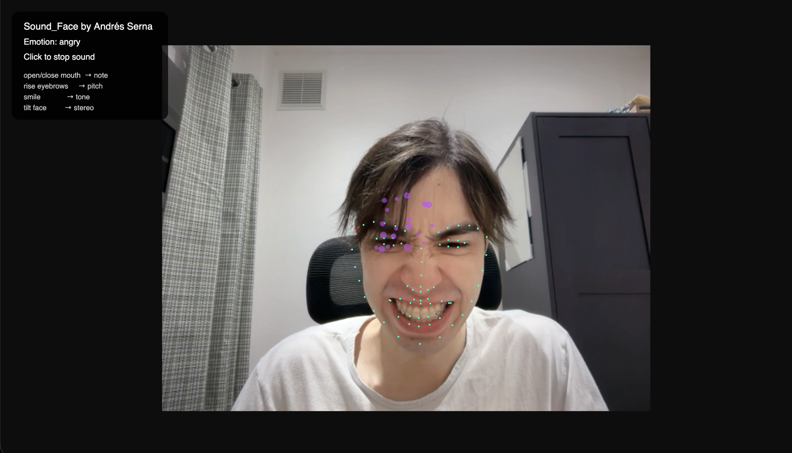
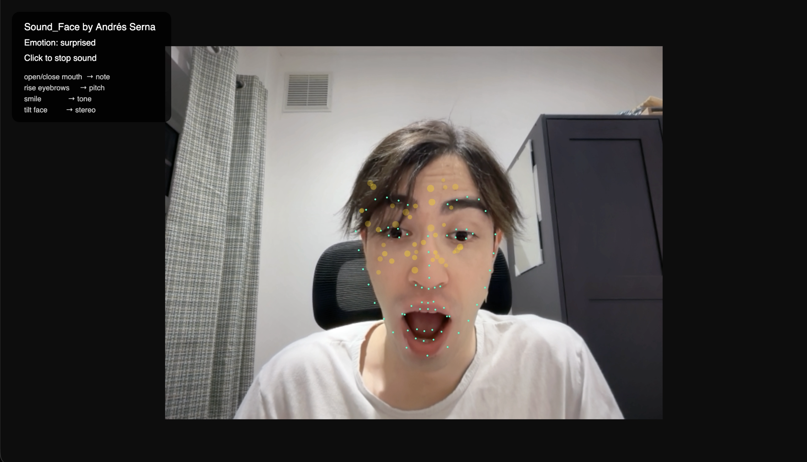
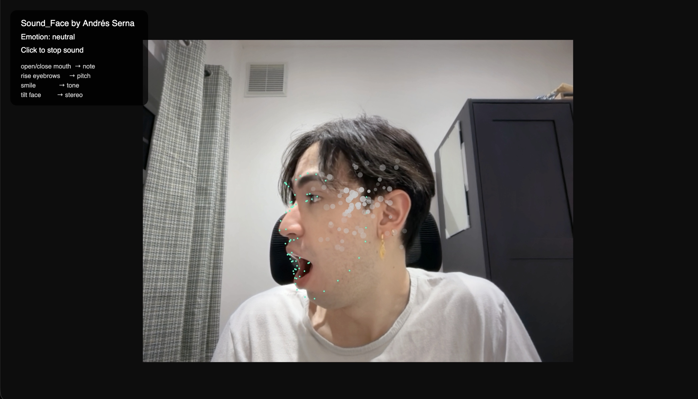

# :notebook: _SK3TCHB00K_WCC2 :notebook:
### _ANDRÉS_SERNA

_"Art is not about what you see, but about what you make others see."_

_- Edgar Degas_

## 0_ST4TEM3NT

My practice-based research sits at the intersection of computational art, interaction design, and system-based thinking. I am particularly interested in how digital technologies can transform everyday gestures, data, or routines into expressive artistic systems. Throughout this module, the workshops allowed me to explore these ideas through a series of small prototypes, ranging from gamified productivity tools and networked drawing applications to experiments in data visualization and machine learning.

A recurring interest in my work is the translation of non-artistic inputs into creative outputs. In my Pin-Up session project, for instance, I explored how everyday tasks could be reframed as game mechanics that influence the growth of a virtual agent. Similarly, my motion-based painting prototype experimented with the gyroscopic sensors of mobile devices, translating bodily movement into collaborative visual gestures. These experiments allowed me to reflect on how interaction design can transform ordinary actions—such as completing a task, moving a device, or generating data—into meaningful aesthetic experiences.

Another key area of interest in my practice is the use of data as an artistic material. I am fascinated by the possibility of shaping information into visual, spatial, or interactive forms that produce alternative narratives and poetic interpretations of knowledge. This perspective also informs my interest in personal knowledge systems, where datasets, memories, and ideas could be organized within dynamic digital structures that function as both archives and creative environments.

For my final project in this module, I plan to continue developing an idea that has been evolving in my practice for several years: a system that converts facial gestures into sound. The concept originated during my undergraduate studies in Colombia, when my technical resources were limited and the project remained relatively constrained. Now, with access to new tools and research environments, I see the possibility of expanding this idea into a more sophisticated interactive instrument.

Technically, I intend to develop the system using computer vision techniques alongside real-time media environments such as TouchDesigner, as well as machine learning libraries like MediaPipe. I am also interested in strengthening my understanding of AI-oriented programming languages—particularly Python—in order to build more flexible and robust gesture-recognition systems.

Conceptually, the project explores the human face as a performative interface. By mapping facial landmarks and micro-gestures to sonic parameters, I aim to create an instrument capable of generating improvised “facial symphonies.” Through this work, I hope to investigate broader questions about embodiment, expressive interfaces, and the relationship between human gesture and computational interpretation.

## 01_P1N_UP_S3SSI0N_W0RK5HOP

*Image of the work installed in the church.*

The first workshop for this sketchbook was structured as a quick pin-up session, where students were expected to present one of their proposals or computational art prototypes from the previous term. In my case, I chose to present my WCC1 final project, titled To_Do_List_RPG.

*Screenshot of the general layout of the project.*

In this project, daily tasks and reminders become side quests for a virtual agent. Completing a quest makes the agent grow and gain new abilities, while leveling up lets the user unlock everyday skills—like cooking or laundry—that help the agent evolve and handle more complex tasks.

*Screenshot of project UI pop-up panel.*

### S3TUP

Personally, I must acknowledge that presenting this project was my first exhibition experience within the University space, and specifically for a long-term work focused on computational arts. The exhibition of this first edition of the project only required a laptop connected to a projector, which showcased how the entire experience worked.

*Images of the work installed in the church.*

### IMPR0V3MENT5

Despite the apparent simplicity of the setup, I quickly realized that details like lighting, space choice, presentation format, and display technologies greatly influenced how the project engaged users. No interaction occurred—perhaps due to setup or interface issues—but this provided a valuable opportunity to learn from technical and conceptual mistakes. In future iterations, presenting the project on a monitor closer to the user, along with improvements in UX and visual language, may better invite interaction.

### L1NK

GitHub Repo to code and documentation: https://github.com/A-serna0415/wcc2-workshop-1.git 

## 02_TILT_PAINTER_W0RK5HOP

The second workshop drew inspiration from the lab exercises on networking and hosting a project on the web. I found myself strongly influenced by the gyroscopic mechanisms in phones and wanted to explore gesture, movement, time, and collaboration among multiple authors by designing a simple painting application that uses motion and gesture as brushes.

*First sketch about idea, interaction and design.*

### C0RE_C0NC3PT

The idea was simple, to turn small personal gestures into a collective drawing, where motion becomes a shared, temporary language.

Built with p5.js, Node.js, Express, and WebSockets the users steer the brush by tilting their phone, and multiple people can join at the same time to leave marks on the same shared canvas.

*Stills about the app being used.*

## DEV3L0PM3NT

Several technical issues emerged while implementing the networked system. The volume of data sent to the server caused occasional lag, and the browser often denied access to the phone’s gyroscope. In future iterations, I am interested in exploring facial detection—using gestures like head tilts to control the brush—and considering faster server solutions to improve stability.

### L1NK

GitHub Repo to code and documentation: https://github.com/A-serna0415/workshop-2-tilt-painter.git

## 03_B00kM4RK5_PER5ONA1_ATlA5_W0RK5HOP

The third workshop was particularly interesting to me, as it focused on data visualization and dynamic, interactive mappings. I am fascinated by the idea of using data as an artistic material, where datasets can be transformed into sculptures, paintings, or interactive experiences that offer new ways of representing and interpreting information.

*Bookmarks atlas general view.*

*Close up to the node's UI.*

### C0RE_C0NC3PT

This is a personal dataset dynamic atlas about some of the web references I have archived over a few years. Each node represents a specific category for the reference. The user can navigates the dynamic atlas and explore each reference as much as they like. Made with p5.js, JSON files and Node.js. I took the bookmarks data stored in my browsers (Safari and Chrome), went through a selection process, and transferred the data into a JSON file.

*Some sketches about the GUI and general visual language for the data representation*

## IN5PIR4TI0N

The main idea for this project takes inspiration from "personal Knowledge database" project by the colombian artist and data scientist Santiago Ortiz.

*Screenshot project "personal Knowledge database" by Santiago Ortiz.*

## DEV3L0PM3NT

I see the development of this project as an opportunity to apply its logic and design to other data narrative and poetic systems I want to explore. For instance, I am interested in creating my own personal knowledge archive, a kind of “mental palace” database where I store not only information, but also memories and ideas.

## L1NK

GitHub Repo to code and documentation: https://github.com/A-serna0415/workshop3_bookmarks_atlas.git

## 04_S0UN_F4C3_W0RK5HOP

Finally, the fourth workshop immersed us directly in the world of machine learning and computer vision using p5.js as the main framework. It was a fascinating experience that allowed me to further explore ideas I had already been developing around artificial intelligence and large language models applied to creative projects.

*Screenshot about Sound Face app first interaction beforesound starts*

### C0RE_C0NC3PT

This is an interactive computer vision system developed with p5.js, ml5.js, and the p5.sound library. Its core concept is to translate human facial gestures into a sound instrument.

Leveraging the ml5.js API, the system detects faces through the webcam and captures the coordinates and distances of each facial landmark. These numerical measurements are then mapped into sound using the p5.sound library.

*Stills about interaction with the facial instrument app*

## DEV3L0PM3NT

The idea of transforming facial gestures into sound is not new to me. It first emerged during my undergraduate studies in Colombia, when my technical resources were limited and the project remained quite constrained. Now, after nearly a year in this master’s program, I see the potential to expand it using interactive design and computer vision tools. I envision developing this facial instrument at a larger scale, using multiple cameras and screens to create improvised “symphonies” generated from facial movement.

## L1NK

GitHub Repo to code and documentation: https://github.com/A-serna0415/workshop_4_Sound_Face.git

## R3FER3NCE5

- Bulger, E., 2026. p5.js sketches. Available at: https://editor.p5js.org/erikabulger/sketches
- Ortiz, S., 2026. Moebio. Available at: https://moebio.com
- Shiffman, D., 2012. The Nature of Code: Simulating Natural Systems with Processing. [ebook] Available at: https://natureofcode.com/ (Chapters 10–11).

