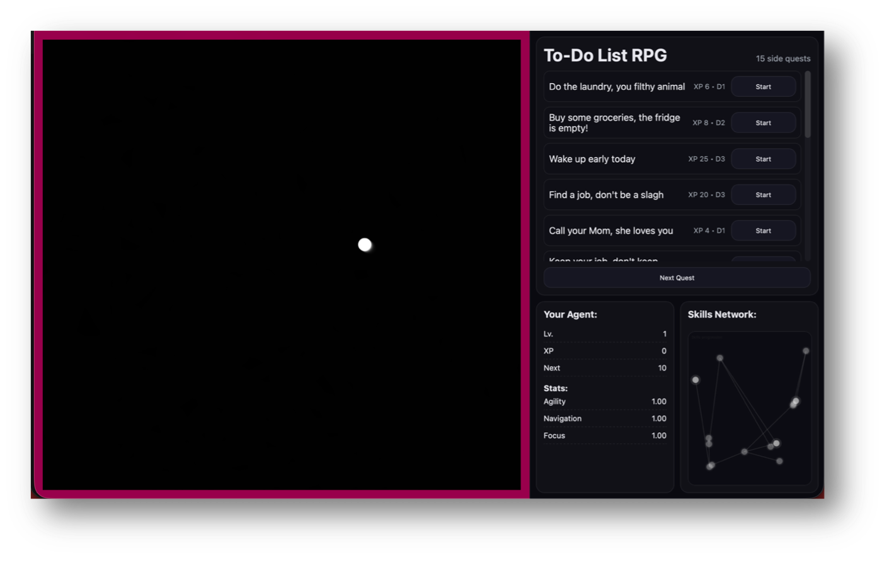
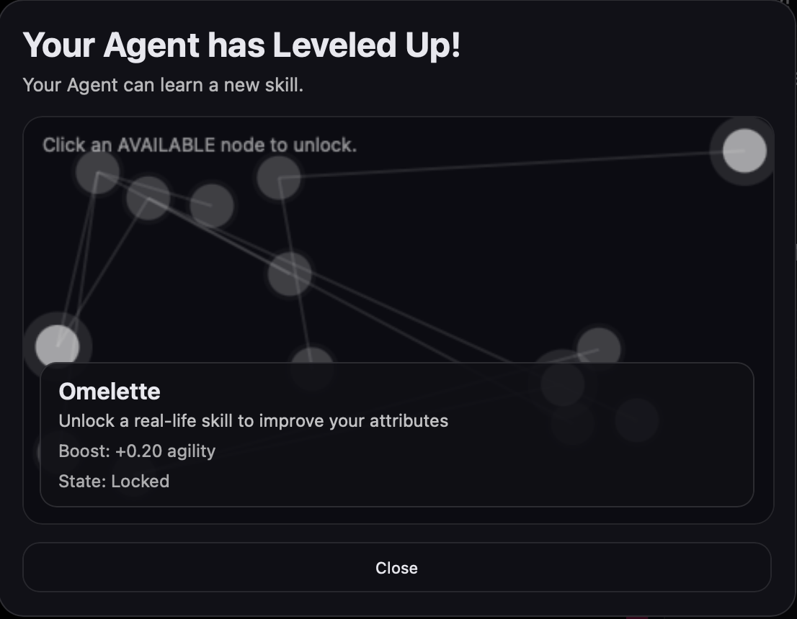
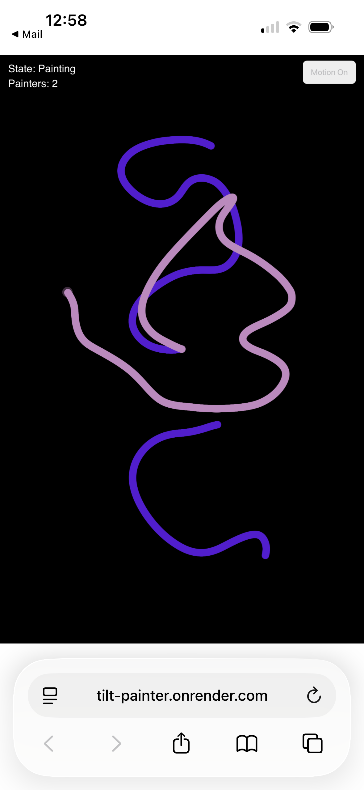
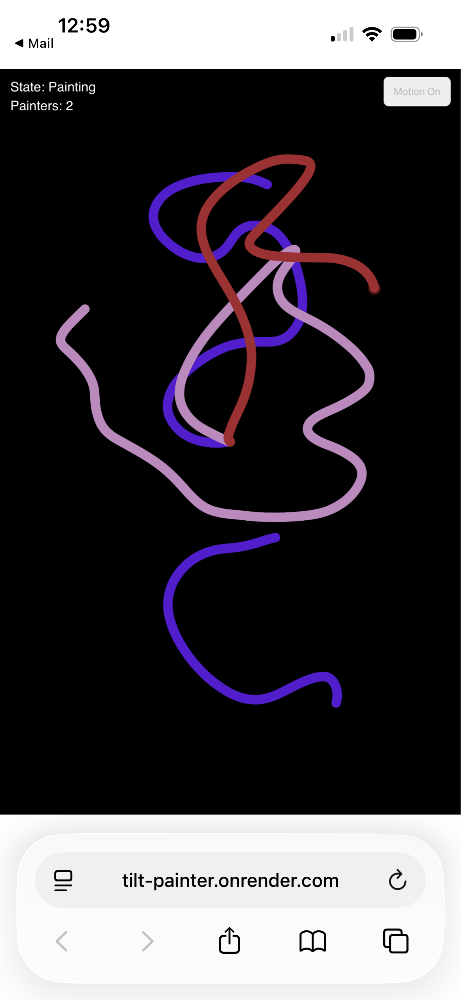
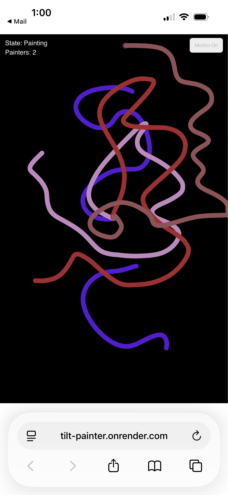
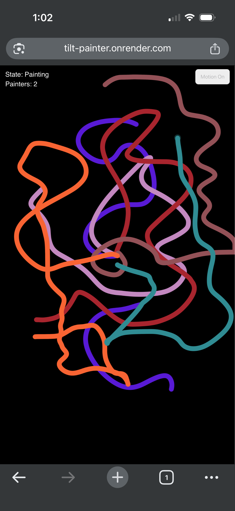

# :notebook: _SK3TCHB00K_WCC2 :notebook:
### _ANDRÉS_SERNA

_"Art is not about what you see, but about what you make others see."_

_- Edgar Degas_

## 0_ST4TEM3NT

Statement here 350 - 500 words.

## 01_P1N_UP_S3SSI0N_W0RK5HOP

*Image of the work installed in the church.*

The first workshop for this sketchbook was structured as a quick pin-up session, where students were expected to present one of their proposals or computational art prototypes from the previous term. In my case, I chose to present my WCC1 final project, titled To_Do_List_RPG.

*Screenshot of the general layout of the project.*

In this project, daily tasks and reminders become side quests for a virtual agent. Completing a quest makes the agent grow and gain new abilities, while leveling up lets the user unlock everyday skills—like cooking or laundry—that help the agent evolve and handle more complex tasks.

*Screenshot of project UI pop-up panel.*

### S3TUP

Personally, I must acknowledge that presenting this project was my first exhibition experience within the University space, and specifically for a long-term work focused on computational arts. The exhibition of this first edition of the project only required a laptop connected to a projector, which showcased how the entire experience worked.

*Images of the work installed in the church.*

### IMPR0V3MENT5

Despite the apparent simplicity of the setup, I quickly realized that details like lighting, space choice, presentation format, and display technologies greatly influenced how the project engaged users. No interaction occurred—perhaps due to setup or interface issues—but this provided a valuable opportunity to learn from technical and conceptual mistakes. In future iterations, presenting the project on a monitor closer to the user, along with improvements in UX and visual language, may better invite interaction.

### L1NK

GitHub Repo to code and documentation: https://github.com/A-serna0415/wcc2-workshop-1.git 

## 02_TILT_PAINTER_W0RK5HOP

The second workshop drew inspiration from the lab exercises on networking and hosting a project on the web. I found myself strongly influenced by the gyroscopic mechanisms in phones and wanted to explore gesture, movement, time, and collaboration among multiple authors by designing a simple painting application that uses motion and gesture as brushes.

*First sketch about idea, interaction and design.*

### C0NC3PT_PROCE55

The idea was simple, to turn small personal gestures into a collective drawing, where motion becomes a shared, temporary language.

Built with p5.js, Node.js, Express, and WebSockets the users steer the brush by tilting their phone, and multiple people can join at the same time to leave marks on the same shared canvas.

*Stills about the app being used.*

## DEV3L0PM3NT

Several technical issues emerged while implementing the networked system. The volume of data sent to the server caused occasional lag, and the browser often denied access to the phone’s gyroscope. In future iterations, I am interested in exploring facial detection—using gestures like head tilts to control the brush—and considering faster server solutions to improve stability.

